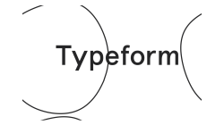

# 

   

  

  

  

  
  
  
  

> This is my Typeform Homepage - UI Clone project 🤗

The Typeform Homepage - UI Clone project.  
Built with ❤︎ by
<a href="https://github.com/maganezf">Maganez Filho</a> and
<a href="https://github.com/maganezf/typeform-homepage-ui-clone/graphs/contributors">
contributors
</a>

# 📌 Table of Contents

- [Live Website](#👀-live-website)
- [Technologies](#💻-technologies)
- [Object / Features](#🎯-object-/-features)
- [How to Run](#👷-how-to-run)
- [Found a bug? Missing a specific feature?](#🐛-issues)
- [Contributing](#🎉-contributing)
- [License](#📕-license)

<h2 align="left"> 🤩 Animation Video: </h2>

  

  
  

# 👀 Live Website

👉 [Click to open Website here](https://typeform-homepage-animation-maganezf.netlify.app//)

# 💻 Technologies

This project was made using the follow technologies:

- [React.js](https://reactjs.org/)
- [Typescript](https://www.typescriptlang.org/)
- [HTML](https://developer.mozilla.org/en-US/docs/Web/HTML)
- [CSS](https://developer.mozilla.org/en-US/docs/Web/CSS)
- [SASS / SCSS](https://sass-lang.com/)
- [Framer Motion](https://framer.com/motion)
- [Styled Components](https://styled-components.com/)
- [Node](https://nodejs.org/)
- [Yarn](https://yarnpkg.com/)
- [Netlify (hosting)](https://netlify.com/)

# 🎯 Object / Features

- Framer Design
- Focused on Framer Motion animations

# 🐛 Issues

Feel free to **file a new issue** with a respective title and description on the the [Typeform](https://github.com/maganezf/typeform-homepage-ui-clone/issues) repository. If you already found a solution to your problem, **i would love to review your pull request**!

# 🎉 Contributing

First of all, thank you for being interested in helping out, your time is always appreciated in every way. 💯

Here's some tips:

- Check the [issues page](https://github.com/maganezf/typeform-homepage-ui-clone/issues) for already opened issues (or maybe even closed ones) that might already address your question/bug/feature request.
- Feature requests are welcomed! Provide some details on why it would be helpful for you and others, explain how you're using bull-board and if possible even some screenshots if you are willing to mock something!

Check out the [contributing](./CONTRIBUTING) page to see the best places to file issues, start discussions and begin contributing.

# 📕 License

Released in 2021 📕 License

Made with ❤︎ by [Maganez Filho](https://github.com/maganezf) 🚀. This project is under the [MIT license](./LICENSE).

Give a ⭐️ if this project helped you!
